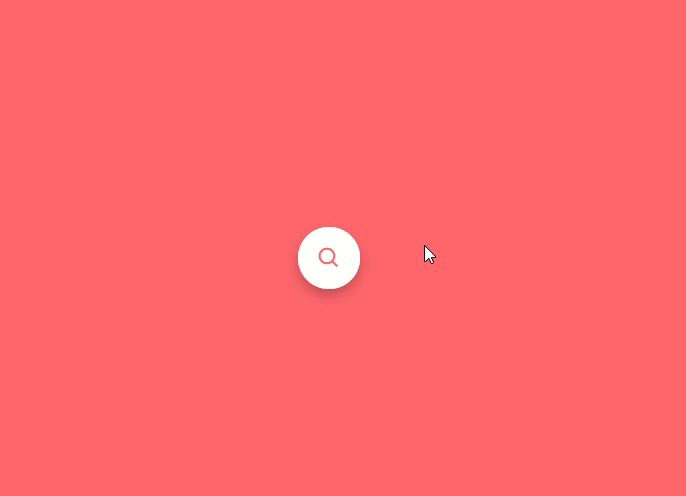

# ✨ Animated Search Bar with Pure CSS

A simple animated search bar that expands when clicked. Created using HTML and CSS with a smooth transition effect.

## 🚀 Live Demo

[View Live Demo]()

## 🛠️ What I Used

- **HTML5**: Semantic structure with hidden checkbox hack
- **CSS3**: Modern styling with smooth transitions
- **Normalize.css**: Cross-browser consistency
- **Boxicons**: Beautiful search icon
- **Flexbox**: Perfect centering technique
- **CSS Transitions**: For buttery smooth animation

## � Design Highlights

1. **Smart HTML Structure**:

   - Hidden checkbox as state controller
   - Clean search bar component with:
     - Fully accessible input field
     - Icon button linked via label

2. **CSS Magic**:

   - Absolute positioning for perfect overlay
   - Circular icon button with vibrant color
   - Initial compact state (50px width)
   - `overflow: hidden` for clean expand effect

3. **Seamless Animation**:

   - CSS-only transition (0.3s linear)
   - Checkbox pseudo-class triggers expansion
   - Smooth width transition from icon to full bar

4. **Visual Appeal**:
   - Depth with subtle box shadow
   - Bold red (#ff676d) color scheme
   - Perfectly centered with Flexbox
