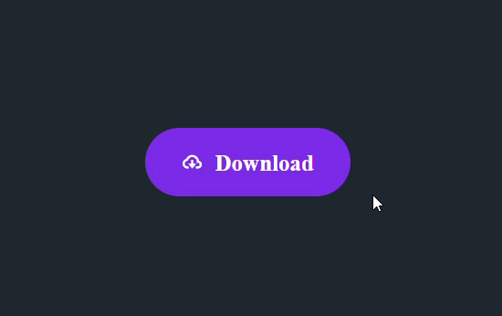

# Animated Download Button with CSS & JavaScript

## Live Demo

[View Live Demo](https://abhijitsinha-dev.github.io/components/02CSS-Button/)

## Features

- Smooth hover and click animations
- Download progress animation
- Success state transition
- Responsive design

## Technologies Used

- HTML5
- CSS3 (with custom animations and transitions)
- JavaScript (for interaction)
- [Normalize.css](https://necolas.github.io/normalize.css/) - for CSS reset
- [Boxicons](https://boxicons.com/) - for the cloud download/check icons

## How I Created This Project

### 1. HTML Structure

Created a simple button element containing:

- An icon from Boxicons (`bx-cloud-download`)
- A text label ("Download")

### 2. CSS Styling

- Designed a purple button with rounded corners
- Used flexbox to center icon and text
- Created a pseudo-element (`::before`) for the progress animation layer
- Implemented smooth transitions for all animations
- Added cubic-bezier timing function for natural motion

### 3. JavaScript Interaction

- Added click event listener to trigger the animation sequence:
  1. Disables the button during animation
  2. Adds "active" class to trigger CSS animations
  3. After 5 seconds (matching animation duration):
     - Removes "active" class
     - Changes icon to checkmark
     - Updates text to "Complete"

### 4. Animation Details

- The button expands width during download
- Purple layer slides in from left to right (progress indication)
- Icon and text slide down and are replaced with success indicators
